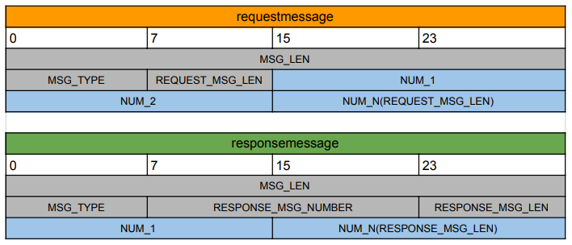

# factorizationtcpclientserver

## message protocol



## compile:
```
make all
```
## before execute the binaries, set LD_LIBRARY_PATH to the output folder:
```
export LD_LIBRARY_PATH=.
```
## output:
```
$ ./factorization_client -n 10 4 34 4
server: 127.0.0.1
port: 8080
numbers: 10 4 34 4
##################################
# NUMBER: 10
# FACTORS: 2 5
##################################
# NUMBER: 4
# FACTORS: 2 2
##################################
# NUMBER: 34
# FACTORS: 2 17
##################################
# NUMBER: 4
# FACTORS: 2 2
##################################
```
## memcheck
```
valgrind --leak-check=full --track-origins=yes ./factorization_client -n 10 4 34 4                  
==28824== Memcheck, a memory error detector
==28824== Copyright (C) 2002-2017, and GNU GPL'd, by Julian Seward et al.
==28824== Using Valgrind-3.15.0 and LibVEX; rerun with -h for copyright info
==28824== Command: ./factorization_client -n 10 4 34 4
==28824== 
server: 127.0.0.1
port: 8080
numbers: 10 4 34 4
##################################
# NUMBER: 10
# FACTORS: 2 5
##################################
# NUMBER: 4
# FACTORS: 2 2
##################################
# NUMBER: 34
# FACTORS: 2 17
##################################
# NUMBER: 4
# FACTORS: 2 2
##################################
==28824== 
==28824== HEAP SUMMARY:
==28824==     in use at exit: 0 bytes in 0 blocks
==28824==   total heap usage: 46 allocs, 46 frees, 12,686 bytes allocated
==28824== 
==28824== All heap blocks were freed -- no leaks are possible
==28824== 
==28824== For lists of detected and suppressed errors, rerun with: -s
==28824== ERROR SUMMARY: 0 errors from 0 contexts (suppressed: 0 from 0)
```
## missing implementations
- Client will include at least three single factorization execution, including factorization of 1, 5 and 10
different numbers in a single execution. Number 32.768 factorization must be included in one of
them. 